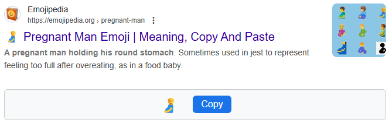
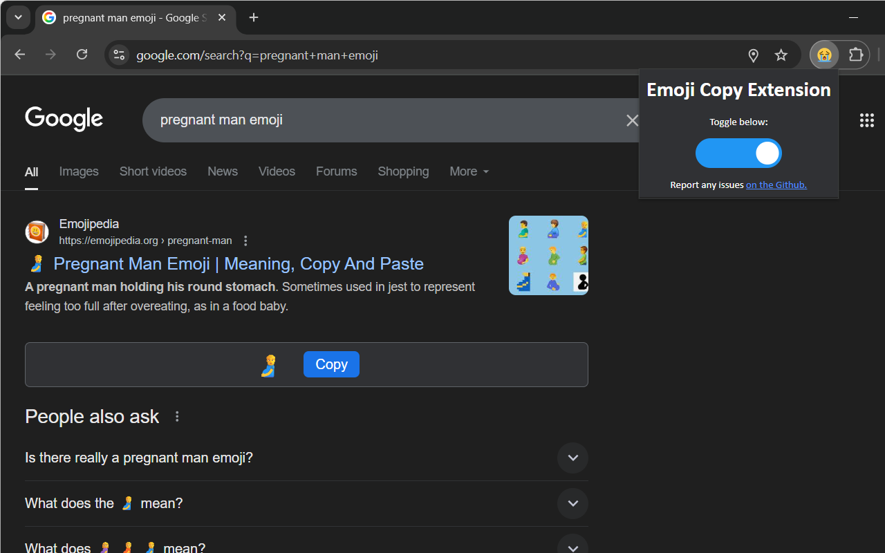
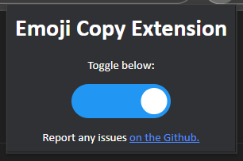
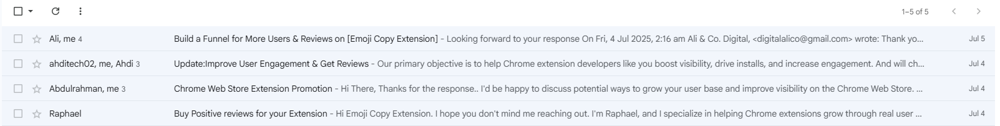

# How I built this Chrome Extension

[Emoji Copy Extension](https://chromewebstore.google.com/detail/emoji-copy-extension/nhkpcjdklcgchjejlnfdpgpcgmailpik?utm_source=github&utm_medium=learn_md) simply adds a box under any [Emojipedia.org](https://emojipedia.org/) search results in Google in which the user can see and copy the respective emoji. I thought of this idea after finding it frustrating to copy an emoji when I search it up because of Google's formatting or go on another stupid website just to be able to copy without formatting easily. Don't ask why I don't just hit `Win+.` on Windows to find an emoji I want to use, I am used to searching it up. :)

<table>
  <tr>
    <th width=1000px>
      
    </th>
    <th width=1000px>
      
    </th>
  </tr>
</table>

## What I learnt along the way

### 1. Developing a userscript

Before starting to build the Chrome extension, I developed a [userscipt](https://github.com/redbackspider77/EmojiCopyBoxForGoogle) with the same functionality. I originally never planned to make this a Chrome Extension, and I already had experience with userscripts.

While doing so, I learnt how to:
- Cycle through the links of search results of a Google.com search results page using `document.getElementsByClassName('zReHs')` and do this for each:
    - Find the respective search result using `.closest('.MjjYud')`, which finds the closest parent element with class `MjjYud`, the container for each search result
    - Ignore the search result if it has the attribute `data-initq`, as it is in the "People also ask" section, and I don't want to deal with such
    - Check if `link.href.startsWith("https://emojipedia.org")` to see if it is an Emojipedia.org search result
    - If it is an Emojipedia.org search result, asynchronously `fetch()` the HTML of the webpage from `"https://corsproxy.io/?" + encodeURIComponent(url)` to avoid CORS policy.
    - Scrape the emoji on which the page is about, which can be identified by the class `Emoji_emoji-large__GG4kj`
    - Create a box under the search result, style it and inject the scraped emoji and a copy button for it which works by `navigator.clipboard.writeText()`ing when clicked; I used ChatGPT for the CSS in the box ;)

### 2. Using the Chrome Extensions API

After deciding to create a Chrome extension from the userscript, development was suprisingly straightforward, partly due to the simplicity of their [documentation](https://developer.chrome.com/docs/extensions).

I learnt how to:
- Create a `manifest.json` to define how the extension runs
- Use `background.js` to retrieve the respective emoji from an Emojipedia.org link instead of using `corsproxy.io` like in the userscript, as Chrome extensions can use a `service_worker` to avoid CORS policy.
- Create and style a popup for the extension which opens when the icon of the extension is clicked:
    - HTML in extension.html
    - CSS in style.css
    - JS in toggle.js - handles updating the on/off switch below ⬇️
- Create an on/off switch to toggle the extension from it's popup using [code I stole from w3schools.com](https://www.w3schools.com/howto/howto_css_switch.asp)
- Persist the on/off state by storing it as a boolean variable in `chrome.storage.local` and only running the injection script in `content.js` only when it is `true`
- Create [icons](https://github.com/redbackspider77/EmojiCopyExtension/tree/master/source/icons) of different sizes for the extension using [this tool](https://alexleybourne.github.io/chrome-extension-icon-generator/)

<table>
  <tr>
    <th width=1000px>
      
    </th>
    <th width=1000px>
      
    </th>
  </tr>
</table>

### 3. Publishing on Chrome Web Store

After finalising the functionality of my extension and making sure it works on other devices like my laptop as well, I decided to [publish](https://developer.chrome.com/docs/webstore/publish) it on the Chrome Web Store.

- First, I had to pay a one-time US$5 fee to register my developer account (Definitely worth it when planning to do more extensions in the future)
- Then I created a new Gmail for my developer account to which anyone can send an email to provide suggestions, feedback, and issues - [redbackspider77@gmail.com](mailto:redbackspider77@gmail.com)
- After pressing "+ New item" on the developer dashboard, I had to:
    - Upload a [zipped file](https://github.com/redbackspider77/EmojiCopyExtension/blob/master/source.zip) of my extension's source files, with `manifest.json` in the root directory
    - Write a seperate description for my extension to the one in the manifest - I also included a link to the GitHub page - and select a category ('Functionality & UI' in my case)
    - Add 1280x800 screenshots - I did 2 screenshots including the functionality of my extension, and the popup; To size the screenshots, I resized my browser to approximately align with a 1280x800 canvas, used `Print Screen` and cropped it to the exact dimensions required
    - Design a 440x280 "small promo tile" which will be seen next to the title of my extension when someone searches for it - I used Paint 3D to make quite a simple one, but you can use any design software you like
    - Linked the GitHub repository and the [page to create a new issue](https://github.com/redbackspider77/EmojiCopyExtension/issues/new) as the "Support URL" for my extension
    - Write a privacy policy and link it to the extension - Although this may sound hard, I just had ChatGPT write one up for me and then hosted it with GitHub Pages to get [this](https://redbackspider77.github.io/EmojiCopyExtension/privacy-policy.html)

### 4. Post Publication

After my item had been reviewed by the Chrome Web Store team (which only took around 2 hours!), I can now:

- Submit new drafts for review - for example, to optimise the extension or improve it's design
- Share it with friends to boost user count (currently, it sits at 5 users, and 3 of those are me on different accounts 😳)
- Move onto a new project while continuing to maintain this one
- Be proud of my work - after all, I did use a few hours of my free time making it!

Here's the link if you want to check it out by the way: [https://chromewebstore.google.com/detail/emoji-copy-extension/nhkpcjdklcgchjejlnfdpgpcgmailpik](https://chromewebstore.google.com/detail/emoji-copy-extension/nhkpcjdklcgchjejlnfdpgpcgmailpik?utm_source=github&utm_medium=learn_md)

### Problems I ran into

- I had many code errors which were are too minor to remember now, but can never be avoided when developing something new; make sure to use `console.log()` when debugging to see where your code gets stuck!
- Uploading 1200x800 screenshot instead of 1280x800 screenshots; Chrome Web Store is fussy on the exact dimensions of all of the promotional images, and one must resize/crop them themselves — mentioning this one because I spent a good 10 minutes figuring out why they were being rejected
- As soon as I published it, I recieved 4 emails from Indians offering me their services to "boost my extension's visibility" - I ignored these now that I know they will never be for free, and I don't have enough money to want to use it on this: 
After all, I am making this for fun, and don't have any way to make that money back yet!

Other than that, making my first Chrome extension was pretty easy!

### More questions?

If you think I could include some more detail, [create a discussion](https://github.com/redbackspider77/EmojiCopyExtension/discussions/new/choose) or [email me](mailto:redbackspider77@gmail.com)!